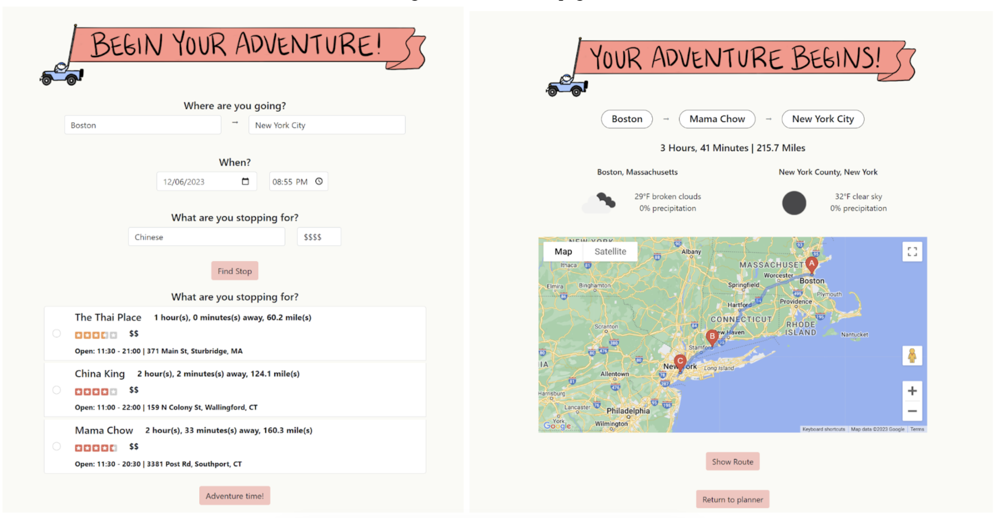
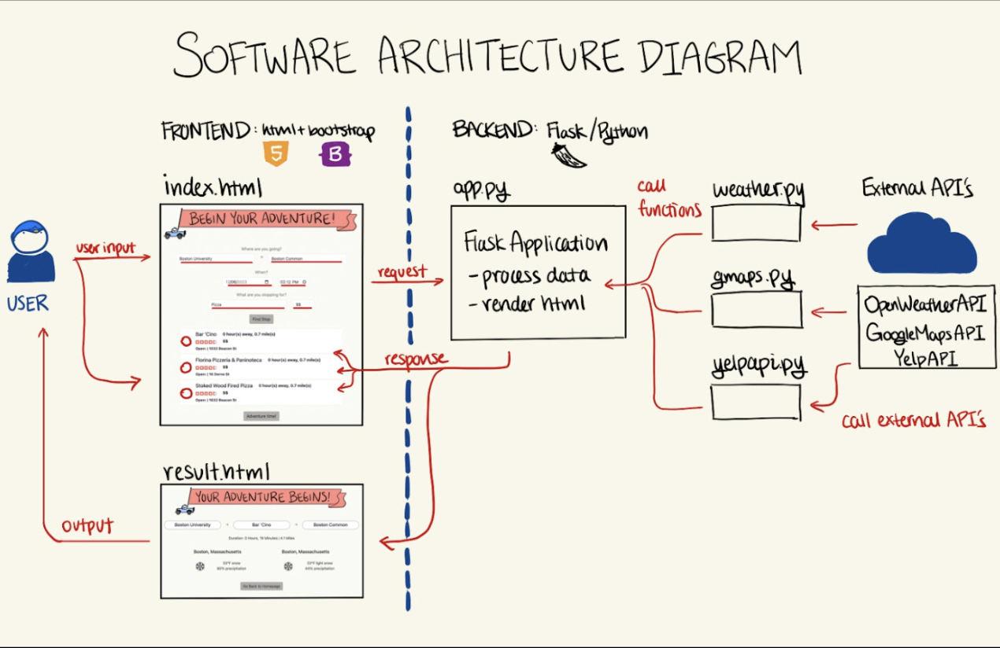

<h1 align="center">
MunchMap Odyssey
</h1>

<p align="center">
A road trip planner designed for food enthusiasts developed by Peter Zhao, Sienna Chien, Varsha Singh, and Jason Jiang
</p>

---

### Project Overview 
Our web application is a road trip planner, designed to curate a road trip for travel enthusiasts. Users provide the journey’s start and end location, start time, cuisine, and budget preference. The web application prompts the user to choose one from, at most, 3 of the best restaurants matching their preferences, then generates a personalized route, with real-time weather forecast for the departure point and destination of the trip. A powerful feature is our application’s ability to calculate the duration of the trip while accounting for estimated traffic time. The route can be previewed and, if the user approves, can then be exported to Google Maps via a button, ensuring a well-guided road trip experience.

<p align="center">
  
</p>

[Link to Demo!](https://youtu.be/OO4-fTPFTX8)


---

### Software Architecture

<p align="center">
  
</p>

---

### Run it yourself!

To run this project, download or clone this repository, then run the following commands in the terminal within the project directory:
```c
source venv/bin/activate
pip install -r requirements.txt
```
Afterwards, run app.py in your preferred IDE. Happy Munchin!